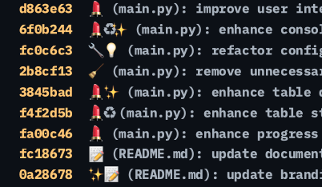

# C0MIT: The AI-Powered Git Commit Assistant


---

## Introduction to C0MIT

**C0MIT** is an open-source Command Line Interface (CLI) tool that leverages Artificial Intelligence (AI) to automate the creation of meaningful Git commit messages. By analyzing the changes you've made, **C0MIT** generates concise and standardized commit messages, making it easier to track changes and collaborate with others.

---
<rewrite_this>



## Bring Your Own LLM and Leverage Git

<rewrite_this>


## Bring Your Own LLM and Leverage Git

<rewrite_this>
Enhance the version control tool we all know and love with intelligent automation:
</rewrite_this>
- **Track Changes**: Keep a history of modifications.
- **Revert to Previous Versions**: Roll back to earlier states.
- **Branch and Merge**: Experiment with new ideas without affecting the main project.
- **Collaborate**: Work with others seamlessly by merging changes and resolving conflicts.

</rewrite_this>
- **Track Changes**: Keep a history of modifications.
- **Revert to Previous Versions**: Roll back to earlier states.
- **Branch and Merge**: Experiment with new ideas without affecting the main project.
- **Collaborate**: Work with others seamlessly by merging changes and resolving conflicts.

</rewrite_this>

---

### Why you'd need `C0MIT`

#### **Save Time**
- **Automated Commit Messages**: Eliminate the need to write commit messages manually.

#### **Ensure Consistency**
- **Standardized Messages**: Maintain a uniform style across all your commit messages.

#### **Improve Clarity**
- **Accurate Summaries**: Generate messages that accurately reflect your code changes.

#### **Boost Productivity**
- **Interactive CLI**: Streamline your Git operations with an easy-to-use interface.

#### **Leverage AI Technology**
- **Smart Insights**: Utilize AI models to interpret and summarize code differences.

---

### Who Can Benefit from C0MIT?

- **Newcomers to Git**: Simplify the process of creating meaningful commit messages.
- **Experienced Developers**: Save time and maintain consistency in commit histories.
- **Teams**: Enhance collaboration through clear and standardized commit logs.
- **Anyone**: Who wants to efficiently track changes in files and folders using AI.

---

## Quick Start Guide

### Prerequisites

- **Python**: Version 3.6 or higher.
- **Git**: Installed and configured on your system.
- **API Access**: An API key from our AI service provider.

### Installation

1. **Clone the Repository**

   Open your terminal and run:

   ```bash
   git clone https://github.com/yourusername/C0MIT.git
   cd C0MIT
   ```

2. **Install Dependencies**

   Install the required Python packages:

   ```bash
   pip install -r requirements.txt
   ```

3. **Configure the Application**

   Rename the example configuration file and update it with your API credentials:

   ```bash
   mv example.config.ini config.ini
   ```

   Edit `config.ini`:

   ```ini
   [API]
   auth_token = YOUR_API_TOKEN
   api_url = https://api.yourservice.com/v1/chat/completions
   model = your-model-name
   max_tokens = 500
   temperature = 0.7
   ```

### Running C0MIT

To use **C0MIT** from any Git directory, add it to your system's PATH:

1. **Make the Script Executable**

   ```bash
   chmod +x /path/to/C0MIT/src/main.py
   ```

2. **Add C0MIT to PATH**

   Add the following line to your shell configuration file (e.g., `.bashrc`, `.zshrc`):

   ```bash
   export PATH=$PATH:/path/to/C0MIT/src
   ```

   Reload your shell configuration:

   ```bash
   source ~/.bashrc  # or source ~/.zshrc
   ```

3. **Run C0MIT**

   In your Git repository, run:

   ```bash
   C0MIT
   ```

   Follow the on-screen prompts to generate and commit your changes.

---

## Version History and Changelog

### [1.0.0] - 2023-10-01

- Initial release with core features:
  - AI-powered commit message generation.
  - Interactive staging and unstaging of files.
  - Git diff visualization within the CLI.

### [0.9.0] - 2023-09-15

- Beta release with basic commit generation capabilities.

---

## Release Roadmap

### Upcoming Features

- **1.1.0**
  - Support for multiple AI service providers.
  - Customizable commit message templates.

- **1.2.0**
  - Graphical User Interface (GUI) for users who prefer not to use the command line.
  - Enhanced diff visualization with syntax highlighting.

- **1.3.0**
  - Compatibility with other version control systems (e.g., Mercurial, SVN).
  - Multi-language support for commit messages.

---

## Technical Implementation

### Installation Procedures for Windows, macOS, and Linux

1. **Install Python and Git**

   - **Python**: Download from the [official website](https://www.python.org/downloads/).
   - **Git**: Download from the [official website](https://git-scm.com/downloads).

2. **Follow the Quick Start Guide**

   Proceed with cloning the repository and installing dependencies as outlined above.

### Environment Configuration Requirements

- **Python Packages**: Ensure all packages in `requirements.txt` are installed.
- **API Credentials**: Valid `auth_token` and `api_url` in `config.ini`.
- **Network Access**: Internet connection is required for API calls.

### API Reference

#### Function: `generate_commit_message(diff: str) -> str`

Generates a commit message using the AI service.

**Parameters**

- `diff` (str): The Git diff of staged changes.

**Returns**

- `str`: The generated commit message.

**Example**

```python
diff = get_git_diff(staged=True)
commit_message = generate_commit_message(diff)
print(commit_message)
```

### Integration Patterns and Best Practices

- **Secure API Credentials**: Keep your `config.ini` file out of version control (add it to `.gitignore`).
- **Automate with Git Hooks**: Integrate **C0MIT** into your Git workflow using pre-commit hooks.
- **Regular Updates**: Periodically update dependencies for security and performance improvements.

### Performance Optimization Guidelines

- **Limit Diff Size**: Stage only relevant changes to reduce processing time.
- **Adjust AI Settings**: Modify `max_tokens` and `temperature` in `config.ini` to balance performance and output quality.
- **Cache Responses**: Implement caching if you frequently regenerate commit messages for the same changes.

### Troubleshooting Guide

#### Common Issues and Solutions

- **API Authentication Errors**
  - *Solution*: Verify your `auth_token` and `api_url` in `config.ini`.

- **No Staged Changes Detected**
  - *Solution*: Stage your changes using `git add <file>` before running **C0MIT**.

- **Network Timeouts**
  - *Solution*: Check your internet connection and firewall settings.

### Known Limitations and Workarounds

- **Large Diffs**
  - *Limitation*: Processing very large diffs may slow down the AI response.
  - *Workaround*: Commit changes in smaller batches.

- **API Rate Limits**
  - *Limitation*: Exceeding API limits may result in errors.
  - *Workaround*: Monitor your usage or upgrade your API plan.

---

## Community Engagement

### Contribution Workflow and Guidelines

We welcome contributions from developers of all experience levels!

1. **Fork the Repository**

   Click the "Fork" button at the top right corner of the GitHub page.

2. **Create a Feature Branch**

   ```bash
   git checkout -b feature/your-feature-name
   ```

3. **Commit Your Changes**

   ```bash
   git commit -m "Description of your changes"
   ```

4. **Push to Your Fork**

   ```bash
   git push origin feature/your-feature-name
   ```

5. **Open a Pull Request**

   Submit your pull request for review.

### Development Setup Guide

#### Setting Up the Development Environment

1. **Clone Your Fork**

   ```bash
   git clone https://github.com/yourusername/C0MIT.git
   cd C0MIT
   ```

2. **Install Development Dependencies**

   ```bash
   pip install -r dev-requirements.txt
   ```

3. **Run Tests**

   ```bash
   pytest
   ```

### Code Review Standards

- **Adhere to PEP 8**: Follow Python's style guidelines for clean and readable code.
- **Write Tests**: Include unit tests for any new features or bug fixes.
- **Update Documentation**: Ensure that any changes are reflected in the documentation.

### Issue and PR Templates

When creating issues or pull requests, please use the provided templates to include all necessary information.

### Security Disclosure Process

If you discover a security vulnerability, please contact us directly at [security@yourdomain.com](mailto:security@yourdomain.com) instead of opening a public issue.

### Licensing Details

This project is licensed under the [MIT License](LICENSE).

### Support Channels and SLAs

- **GitHub Issues**: For bug reports and feature requests.
- **Email Support**: [support@yourdomain.com](mailto:support@yourdomain.com)
- **Response Time**: We aim to respond within 2 business days.

### Code of Conduct

We are committed to fostering a welcoming community. Please read our [Code of Conduct](CODE_OF_CONDUCT.md) for more information.

---

## Glossary

- **AI (Artificial Intelligence)**: Technology that enables computers to perform tasks that typically require human intelligence.
- **API (Application Programming Interface)**: A set of rules that allows programs to communicate with each other.
- **CLI (Command Line Interface)**: A text-based interface used to interact with software.
- **Commit**: A record of changes made to files in a Git repository.
- **Diff**: A display showing the changes between two versions of a file.
- **Git**: A version control system for tracking changes in files and coordinating work on those files among multiple people.
- **Staging**: The process of selecting changes to include in the next commit.
- **Unstaging**: Removing changes from the staging area.
- **Version Control System**: Software that helps manage changes to source code over time.

---

## Badges


