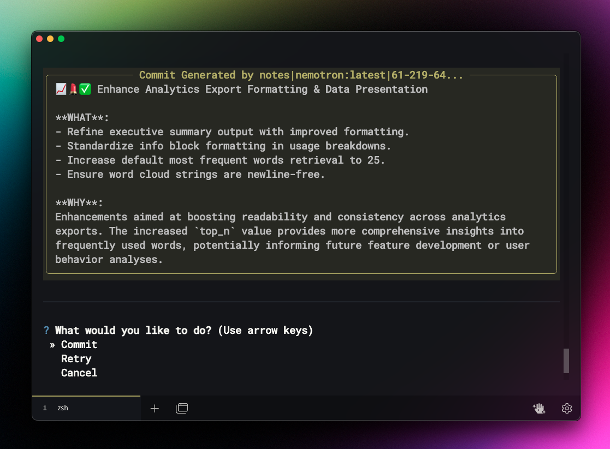

<h1 align="center">GitSmart</h1>
<h3 align="center">The AI-Powered Git Commit Assistant</h3>

<p align="center">
  
</p>

<p align="center">
  <a href="#-installation"></a>
  <a href="#-version-history-and-changelog"></a>
  <a href="LICENSE"></a>
  <a href="#"></a>
</p>

## 📋 Table of Contents

- [What is GitSmart?](#what-is-gitsmart)
  - [Why You Need GitSmart](#why-you-need-gitsmart)
  - [Before and After GitSmart](#before-and-after-gitsmart)
- [🚀 Key Features](#-key-features)
- [🎬 Demo](#-demo)
- [🛠️ How It Works](#️-how-it-works)
- [📥 Installation](#-installation)
  - [Quick Setup (Recommended)](#quick-setup-recommended)
  - [Manual Installation](#manual-installation)
- [🔧 Usage](#-usage)
- [🗺️ Roadmap](#️-roadmap)
- [⚙️ Technical Details](#️-technical-details)
  - [System Requirements](#system-requirements)
  - [Performance Optimization](#performance-optimization)
- [🤝 Contributing](#-contributing)
  - [Code Standards](#code-standards)
- [📝 Version History and Changelog](#-version-history-and-changelog)
- [📄 License](#-license)
- [📚 Glossary](#-glossary)

## What is GitSmart?

**GitSmart** is an open-source Command Line Interface (CLI) tool that leverages Artificial Intelligence (AI) to automate the creation of meaningful Git commit messages. By analyzing the changes you've made, **GitSmart** generates concise and standardized commit messages, making it easier to track changes and collaborate with others.

### Why You Need GitSmart

- **💻 Save Time**: Automatically generate precise commit messages, reducing manual effort.
- **🧩 Maintain Consistency**: Ensure a clean, standardized, and organized commit history.
- **🔄 Improve Workflow**: Simplify your Git process with an intuitive and interactive CLI.
- **👥 Enhance Collaboration**: Produce commit messages that accurately reflect changes, improving code reviews.
- **🤖 Custom AI Integration**: Choose from leading language models like OpenAI, Anthropic, or Llama for tailored AI assistance that adapts to your coding style.

### Before and After GitSmart

**Before:**

Your Git commit messages are a tangled mess—full of vague descriptions like "fix stuff" or "update files," making it hard to track changes and collaborate effectively.

**After:**

Run **GitSmart** and enjoy the perks of AI-powered commit messages that are clear, standardized, and meaningful. Effortlessly track changes, collaborate seamlessly, and maintain a professional project history without the hassle.

<p align="center">
  <video autoplay loop muted playsinline width="75%">
    <source src="assets/preview.webm" type="video/webm">
    Your browser does not support the video tag. Here is an image instead:
    
  </video>
</p>

## 🚀 Key Features

- **AI-Powered Commit Messages**: Automatically generate meaningful and standardized commit messages based on your code changes.
- **Track Changes**: Maintain a detailed history of modifications to your codebase.
- **Revert to Previous Versions**: Easily roll back to earlier states of your project.
- **Branch and Merge**: Experiment with new ideas without affecting the main project branch.
- **Collaborate Seamlessly**: Work with others by merging changes and resolving conflicts efficiently.

## 🎬 Demo

See how GitSmart transforms your commit workflow with AI-driven chain-of-thought analysis for a deep understanding of any change:

```shell
╭─────────────────────────────────── assets/no-bg.png [Staged] ────────────────────────────────────╮
│                                                                                                  │
│                       1 diff --git a/assets/no-bg.png b/assets/no-bg.png                         │
│                       2 new file mode 100644                                                     │
│                       3 index 0000000..caa7508                                                   │
│                       4 Binary files /dev/null and b/assets/no-bg.png differ                     │
│                                                                                                  │
╰───────────────────────────────────────────── +0, -0 ─────────────────────────────────────────────╯
```

GitSmart analyzes this change and produces:

```markdown
💄 Update README Image Asset

**WHAT:** Replaced `comit.png` with `no-bg.png` in README.md
**WHY:** Refresh project's visual identity by updating the GitSmart Overview Image to a new version without background (`no-bg.png`), enhancing overall UI consistency and appeal.

**DETAILS:**
- **Affected File(s):**
  - `README.md`: Updated image link to reflect new asset.
  - `assets/no-bg.png`: Newly added image file, replacing the original `comit.png`.
- **Impact:** This change modernizes the project's front-facing visuals in the README, ensuring a more engaging and up-to-date first impression for visitors.
```

## 🛠️ How It Works

GitSmart uses a sophisticated chain-of-thought analysis to understand your code changes:

1.  **Analyze Changes**: Examines diffs between your working directory, staging area, and the Git repository.
2.  **Process Context**: Leverages AI to understand the context and significance of your changes.
3.  **Generate Message**: Creates a structured, informative, and standardized commit message.
4.  **Commit Changes**: Handles the Git commit process with your approval, or allows you to refine the message.

## 📥 Installation

### Quick Setup (Recommended)

You can quickly set up GitSmart using our automated installation script:

```bash
# Clone the repository
git clone https://github.com/clarkandrew/GitSmart.git
cd GitSmart

# Run the setup script
bash setup.sh
```

This script will:
- Set up a Python virtual environment.
- Install all dependencies from `requirements.txt`.
- Create a `config.ini` file from `example.config.ini` for your API credentials.
- Add convenient aliases (`gitsmart` and `gg`) to your shell configuration file (e.g., `.bashrc`, `.zshrc`).

Follow the on-screen prompts to complete the setup.

### Manual Installation

If you prefer to install manually, follow these steps:

#### 1. Clone the Repository

```bash
git clone https://github.com/clarkandrew/GitSmart.git
cd GitSmart
```

#### 2. Setup Python Virtual Environment

Create and activate a virtual environment (requires Python 3.7 or higher):

```bash
# Create the virtual environment
python -m venv venv

# Activate the virtual environment
# On Windows:
venv\Scripts\activate
# On macOS/Linux:
source venv/bin/activate
```

#### 3. Install Dependencies

Install the required Python packages:

```bash
pip install -r requirements.txt

# Install the package in development mode
pip install -e .
```

#### 4. Configure the Application

Rename the example configuration file and update it with your API credentials:

```bash
cp example.config.ini config.ini
```

Edit `config.ini` with your preferred text editor:

```ini
[API]
auth_token = YOUR_API_TOKEN
api_url = https://api.yourservice.com/v1/chat/completions
model = your-model-name
max_tokens = 500
temperature = 0.7
```

#### 5. Setup Command Aliases

Add convenient aliases for `gitsmart` and `gg` to your shell configuration file (e.g., `.bashrc`, `.zshrc`):

```bash
# Add these lines to your shell configuration file
alias gitsmart="python -m GitSmart.main"
alias gg="python -m GitSmart.main"
```

Reload your shell configuration:

```bash
source ~/.bashrc  # or source ~/.zshrc
```

## 🔧 Usage

In any Git repository, you can now use:

```bash
# Use the full command
gitsmart

# Or the shorter alias
gg
```

Follow the on-screen prompts to:
1. View your staged and unstaged changes.
2. Interactively stage or unstage files.
3. Let GitSmart generate an AI-powered commit message.
4. Review and optionally edit the generated message.
5. Commit your changes with the perfect message.

<p align="center">
  
</p>

## 🗺️ Roadmap

### Upcoming Features

- **1.1.0**
  - Support for more AI service providers (e.g., Google Gemini).
  - Customizable commit message templates and styles.
- **1.2.0**
  - Optional Graphical User Interface (GUI) for users who prefer it over the command line.
  - Enhanced diff visualization with syntax highlighting and side-by-side views.
- **Future Ideas**
  - Integration with popular IDEs.
  - Pre-commit hook for automated suggestions.

## ⚙️ Technical Details

### System Requirements
- Python 3.7 or higher.
- Git 2.20 or higher.
- Internet connection for API calls to AI models.

### Performance Optimization
- **Limit Diff Size**: Stage only relevant changes to reduce processing time for the AI.
- **Adjust AI Settings**: Modify `max_tokens` and `temperature` in `config.ini` to balance performance and output quality.
- **Cache Responses**: (Future Feature) Implement caching if you frequently regenerate commit messages for the same changes.

For more detailed technical information, installation procedures for different OS, and environment configuration, please see our [Technical Documentation](docs/TECHNICAL.md) (Coming Soon!).

## 🤝 Contributing

We welcome contributions from developers of all experience levels! Your help is essential for making GitSmart even better.

1.  **Fork the Repository**: Click the "Fork" button at the top right of the GitHub page.
2.  **Create a Feature Branch**: `git checkout -b feature/your-amazing-feature`
3.  **Commit Your Changes**: `git commit -m "feat: Add some amazing feature"` (Try using GitSmart for your commits!)
4.  **Push to Your Fork**: `git push origin feature/your-amazing-feature`
5.  **Open a Pull Request**: Submit your pull request for review, detailing the changes you've made.

Please read our [CONTRIBUTING.md](CONTRIBUTING.md) guide for more details on our development process, code review standards, and issue/PR templates.

### Code Standards
- Adhere to PEP 8 Python style guidelines.
- Write unit tests for any new features or bug fixes.
- Update documentation to reflect any changes.
- Ensure your code is well-commented and readable.

We also adhere to a [Code of Conduct](CODE_OF_CONDUCT.md). Please read it to understand the community standards.

## 📝 Version History and Changelog

### [1.0.0] - 2023-10-01
- Initial release with core features:
  - AI-powered commit message generation.
  - Interactive staging and unstaging of files.
  - Git diff visualization within the CLI.

### [0.9.0] - 2023-09-15
- Beta release with basic commit generation capabilities.

For a detailed changelog, see [CHANGELOG.md](CHANGELOG.md) (Coming Soon!).

## 📄 License

This project is licensed under the [MIT License](LICENSE).

## 📚 Glossary

| Term                      | Definition                                                                                             |
| :------------------------ | :----------------------------------------------------------------------------------------------------- |
| **AI**                    | Artificial Intelligence: Technology enabling computers to perform tasks requiring human intelligence.  |
| **API**                   | Application Programming Interface: A set of rules allowing programs to communicate.                    |
| **CLI**                   | Command Line Interface: A text-based interface for interacting with software.                          |
| **Commit**                | A snapshot of changes made to files in a Git repository.                                               |
| **Diff**                  | A display showing the differences between two versions of a file or set of files.                      |
| **Git**                   | A distributed version control system for tracking changes and coordinating work.                       |
| **Staging Area (Index)**  | An intermediate area where you prepare changes before committing them.                                 |
| **Version Control System**| Software that helps manage changes to source code over time.                                           |

---

**Start transforming your Git workflow today with GitSmart. Enhance your productivity, improve collaboration, and maintain a clean project history effortlessly.**

[Get Started Now](#-installation) • [Report a Bug](../../issues) • [Request a Feature](../../issues)
