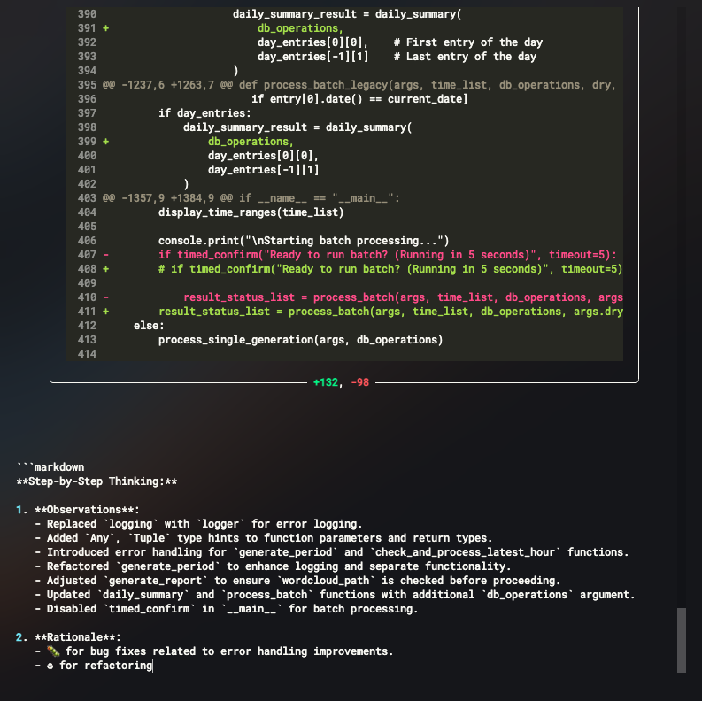

<h1 align="center">GitSmart</h1>

<p align="center">
  
</p>

<p align="center">
  <em>The AI-Powered Git Commit Assistant</em>
</p>

<p align="center">
  
  
  
</p>

---

<p align="center">
  
</p>

GitSmart is an open-source Command Line Interface (CLI) tool that leverages Artificial Intelligence (AI) to automate the creation of meaningful Git commit messages. By analyzing your changes, **GitSmart** generates concise and standardized commit messages—making it easier to track work and collaborate.

---

## Why You'd Need GitSmart

### Streamlined Workflow
- **Automated Commit Messages**: Save time by generating precise commit messages automatically.

### Consistent Version History
- **Standardized Messages**: Keep a clean, organized commit log for easier tracking and debugging.

### Seamless Integration
- **User-Friendly CLI**: An interactive interface built for efficiency and ease of use.

### Enhanced Code Reviews
- **Accurate Summaries**: Generate commit messages that reflect your changes, improving review quality.

### Custom AI Integration
- **Adaptive AI Insights**: Pick from OpenAI, Anthropic, or Llama to tailor AI assistance to your coding style.

---

## Key Features

- **AI-Powered Commit Messages**
- **Track Changes**
- **Revert to Previous Versions**
- **Branch and Merge**
- **Collaborate Seamlessly**

---

## AI-driven Chain-of-Thought Analysis

```shell
╭─────────────────────────────────── assets/no-bg.png [Staged] ────────────────────────────────────╮
│                                                                                                  │
│                       1 diff --git a/assets/no-bg.png b/assets/no-bg.png                         │
│                       2 new file mode 100644                                                     │
│                       3 index 0000000..caa7508                                                   │
│                       4 Binary files /dev/null and b/assets/no-bg.png differ                     │
│                                                                                                  │
╰───────────────────────────────────────────── +0, -0 ─────────────────────────────────────────────╯
````

**Step-by-Step Thinking:**
```markdown
1. **Observations**

   * README updated: image link changed from `assets/comit.png` to `assets/no-bg.png`
   * New file added: `assets/no-bg.png`
   * Indicates a visual update (aesthetic/branding)

2. **Rationale**

   * Icon: 💄 for UI improvement
   * Theme: graphical asset update for branding/layout
```

**Generated Commit**
```markdown
💄 Update README Image Asset

**WHAT:** Replaced `comit.png` with `no-bg.png` in README.md
**WHY:** Refresh project’s visual identity by updating the overview image to one without a background, enhancing UI consistency.

**DETAILS:**
- **Affected Files:**
  - `README.md` (image link updated)
  - `assets/no-bg.png` (new asset)
- **Impact:** Modernizes the project’s front-facing visuals for a more engaging first impression.
```


---

## Getting Started

### Quick Setup (Recommended)

```bash
git clone https://github.com/clarkandrew/GitSmart.git
cd GitSmart
chmod +x setup.sh
./setup.sh

# Then:
gitsmart   # or simply: c
```

This script will:

* Create a Python virtual environment
* Install all dependencies
* Generate a default `config.ini`
* Add `gitsmart` and `c` aliases to your shell

Follow the prompts to finish setup.

### Manual Installation

1. **Clone the repo**

   ```bash
   git clone https://github.com/clarkandrew/GitSmart.git
   cd GitSmart
   ```

2. **Create & activate a venv**

   ```bash
   python -m venv venv

   # Windows
   venv\Scripts\activate

   # macOS/Linux
   source venv/bin/activate
   ```

3. **Install dependencies**

   ```bash
   pip install -r requirements.txt
   pip install -e .
   ```

4. **Configure**

   ```bash
   cp example.config.ini config.ini
   ```

   Edit `config.ini`:

   ```ini
   [API]
   auth_token  = YOUR_API_TOKEN
   api_url     = https://api.yourservice.com/v1/chat/completions
   model       = your-model-name
   max_tokens  = 500
   temperature = 0.7
   ```

5. **Add aliases** to your shell config (`.bashrc` / `.zshrc`):

   ```bash
   alias gitsmart="python -m GitSmart.main"
   alias c="python -m GitSmart.main"
   ```

   Reload:

   ```bash
   source ~/.bashrc  # or source ~/.zshrc
   ```

### Running GitSmart

```bash
gitsmart  # or: c
```

Follow the prompts to generate and commit your changes.

---

<p align="center">
  
</p>

---

## Version History & Changelog

### \[1.0.0] – 2023-10-01

* Initial release

  * AI-powered commit messages
  * Interactive staging/unstaging
  * CLI diff visualizations

### \[0.9.0] – 2023-09-15

* Beta with basic commit generation

---

## Release Roadmap

* **1.1.0**: Multi-AI provider support & customizable templates
* **1.2.0**: GUI & enhanced diff highlighting

---

## Technical Implementation

1. Install [Python](https://python.org) & [Git](https://git-scm.com).
2. Follow the Quick Start above.

**Requirements:**

* Packages in `requirements.txt`
* Valid credentials in `config.ini`
* Internet for API calls

**Best Practices:**

* Secure `config.ini` (add to `.gitignore`)
* Use Git hooks for automation
* Keep dependencies updated

---

## Community Engagement

### How to Contribute

1. Fork the repo
2. Create a branch:

   ```bash
   git checkout -b feature/awesome-feature
   ```
3. Commit & push:

   ```bash
   git commit -m "Add awesome feature"
   git push origin feature/awesome-feature
   ```
4. Open a PR for review

Follow PEP 8, write tests, and update docs.
See [LICENSE](LICENSE) for MIT terms and [Code of Conduct](CODE_OF_CONDUCT.md).

---

## Before & After: Transforming Your Commits

**Before:**
Vague messages like “fix stuff” or “update files”.

**After:**
AI-powered, clear, standardized commits—effortless tracking and collaboration.

---

## Glossary

* **AI**: Artificial Intelligence
* **API**: Application Programming Interface
* **CLI**: Command Line Interface
* **Commit**: A record of changes
* **Diff**: Changes between file versions
* **Staging**: Selecting changes for the next commit
* **Unstaging**: Removing changes from staging

---

**Start transforming your Git workflow today with GitSmart. Enhance productivity, improve collaboration, and maintain a clean project history—effortlessly.**
[Get Started Now](#getting-started)
